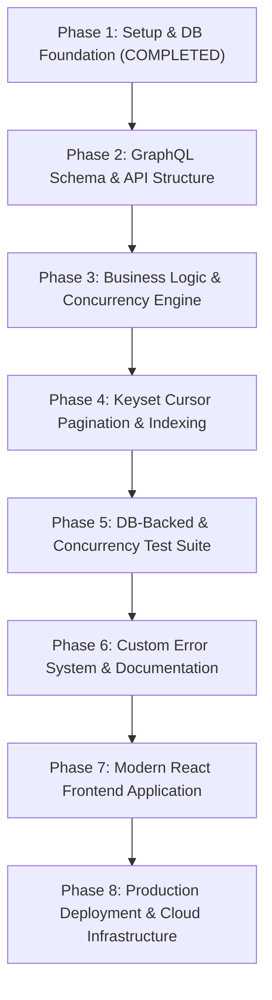

# Master Project Plan: Concurrent-Safe Room Booking System

## Executive Summary & Architecture Blueprint

This document specifies the end-to-end architectural roadmap and 8-phase execution plan for the **Room Booking GraphQL API & Web Application**. Built with a focus on strict type safety, concurrency-safe booking consistency, and efficient querying, the system guarantees double-booking prevention under simultaneous request loads by using PostgreSQL row locking on target Resource rows within interactive database transactions.

### Core Stack & Framework Specifications
- **Runtime**: Bun (Strict TypeScript mode, native test runner `bun test`)
- **API Engine**: GraphQL Yoga (v5) with schema-first `.graphql` file declarations (`DateTime` scalar for timestamps)
- **ORM & Data Layer**: Prisma ORM (v7) with PostgreSQL
- **Frontend Engine**: React + Material UI (MUI) in `frontend/` monorepo structure
- **Coding Standard**: Strict typing, explicit error boundaries, half-open interval collision validation `[startTime, endTime)`

---

## Directory Architecture

```text
Meeting_Room_Booking_System/
│
├── .agents/                                # Workspace rules & AI assistant constraints
│   └── rules/
│       └── project_rules.md
│
├── backend/                                # Backend Bun + GraphQL Yoga application root
│   ├── app/                                # Core application source code
│   │   ├── graphql/
│   │   │   ├── schema/                     # Schema-first .graphql definition files
│   │   │   │   ├── resource.graphql
│   │   │   │   ├── booking.graphql
│   │   │   │   └── pagination.graphql
│   │   │   └── resolvers/                  # Thin resolver delegators
│   │   │       ├── resource.resolver.ts
│   │   │       ├── booking.resolver.ts
│   │   │       └── index.ts
│   │   │
│   │   ├── services/                       # Core domain business logic layer
│   │   │   ├── resource.service.ts
│   │   │   └── booking.service.ts
│   │   │
│   │   ├── db/                             # Shared Prisma Client singleton connection
│   │   │   └── prisma.ts
│   │   │
│   │   └── index.ts                        # GraphQL Yoga HTTP server entrypoint
│   │
│   ├── prisma/                             # Prisma schema & migration management
│   │   ├── migrations/                     # Raw SQL migration history
│   │   └── schema.prisma                   # Entity models, enums & composite indexes
│   │
│   ├── tests/                              # Real database-backed Bun test suite
│   │   ├── resource.test.ts
│   │   ├── booking.test.ts
│   │   ├── availability.test.ts
│   │   ├── pagination.test.ts
│   │   ├── concurrency.test.ts             # Concurrent double-booking race condition tests
│   │   └── graphql.test.ts                 # Full HTTP E2E API tests
│   │
│   ├── .env                                # Local environment secrets
│   ├── package.json                        # Dependencies and Bun scripts
│   ├── prisma.config.ts                    # Prisma v7 environment configuration
│   └── tsconfig.json                       # TypeScript strict compiler config
│
├── frontend/                               # React UI Application (Phase 7)
│   ├── app/
│   │   ├── components/                     # Modern visual design components
│   │   ├── pages/                          # Dashboard, Timeline, Booking views
│   │   ├── graphql/                        # Client queries & mutations
│   │   └── index.tsx
│   ├── package.json
│   └── ...
│
└── documentations/                         # Technical documentation artifacts
    ├── project_plan/
    │   └── planning.md                     # [THIS FILE] Master 8-Phase Architectural Plan
    └── technical_documentation/
        ├── phase-1.md                      # Phase 1 completion report
        ├── phase-2.md                      # Phase 2 technical completion report
        └── ...
```

---

## 8-Phase Implementation Plan



---

### Phase 1: Project Setup & Database Layer Foundation (STATUS: COMPLETED ✅)

#### Objectives
Initialize the monorepo workspace, configure the Bun runtime environment, establish PostgreSQL database integration via Prisma v7, define core entities (`Resource`, `Booking`), and apply database migration scripts with optimized composite indexes.

#### Key Accomplishments
1. **Monorepo Setup**: Configured isolated `backend/` project root with Bun runtime and strict TypeScript options (`tsconfig.json`).
2. **Prisma v7 Configuration**: Implemented programmatic environment loading via `backend/prisma.config.ts` referencing `DATABASE_URL`.
3. **Data Modeling**: Declared `Resource` and `Booking` models along with the `BookingStatus` enum (`CONFIRMED`, `CANCELLED`).
4. **Performance Indexing**:
   - `@@index([startTime, id])`: Optimizes cursor-based pagination query performance when sorted chronologically by `startTime`.
   - `@@index([resourceId, status, startTime, endTime])`: Accelerates overlap collision checks by filtering active (`CONFIRMED`) bookings for target resources.
5. **Initial Migration**: Executed `bun run db:migrate` creating raw PostgreSQL tables, enums, foreign keys, and indexes. Documented in `documentations/technical_documentation/phase-1.md`.

---

### Phase 2: GraphQL Schema Design & Service Architecture Layer

#### Objectives
Establish clean architecture separation within `backend/app/`, implement schema-first `.graphql` contract definitions, construct a singleton database access module, and separate GraphQL resolvers from business services.

#### Detailed Execution Steps

##### Step 2.1 — Application Structure Setup
Create the modular code architecture inside `backend/app/`:
```text
backend/app/
├── graphql/
│   ├── schema/
│   └── resolvers/
├── services/
├── db/
└── index.ts
```
Data flow strictly follows:
`GraphQL Request` → `Yoga Server` → `Resolvers` → `Services` → `Prisma Client` → `PostgreSQL`

##### Step 2.2 — Singleton Prisma Client Layer
Create `backend/app/db/prisma.ts` to export a single instance of `PrismaClient` across the application lifecycle to prevent connection pool exhaustion.

##### Step 2.3 — Schema-First Definition Files
Define schema files in `backend/app/graphql/schema/`:
- `resource.graphql`:
  - `type Resource { id: ID!, name: String!, capacity: Int!, createdAt: String! }`
  - Queries: `resources: [Resource!]!`, `resource(id: ID!): Resource`
  - Mutations: `createResource(name: String!, capacity: Int!): Resource!`
- `booking.graphql`:
  - `enum BookingStatus { CONFIRMED, CANCELLED }`
  - `type Booking { id: ID!, title: String!, startTime: String!, endTime: String!, status: BookingStatus!, resourceId: String!, resource: Resource!, createdAt: String! }`
  - Queries: `bookings(resourceId: String, status: BookingStatus, first: Int, after: String): BookingConnection!`, `availability(resourceId: String!, startTime: String!, endTime: String!): AvailabilityResult!`
  - Mutations: `createBooking(...)`, `rescheduleBooking(...)`, `cancelBooking(...)`, `deleteBooking(...)`
- `pagination.graphql`:
  - Standard GraphQL Relay cursor types (`PageInfo`, `BookingEdge`, `BookingConnection`).

##### Step 2.4 — Service Layer Abstraction
Create dedicated service modules:
- `backend/app/services/resource.service.ts`: Handles resource CRUD operations (creation, listing, and individual resource retrieval).
- `backend/app/services/booking.service.ts`: Encapsulates all booking workflows, overlap computations, availability lookups, PostgreSQL resource locking, and status state transitions.

##### Step 2.5 — Resolver Integration Layer
Build thin resolvers in `backend/app/graphql/resolvers/` that validate incoming payload types, delegate execution directly to the service layer, and map outputs.

---

### Phase 3: Core Business Logic & Concurrency Protection Engine

#### Objectives
Implement business domain rules, time window validations, half-open interval overlap checks `[startTime, endTime)`, self-excluding rescheduling logic, and PostgreSQL transaction row locking to prevent double-booking under high concurrent load.

#### Detailed Execution Steps

##### Step 3.1 — Time Range & Input Validation
Validate that incoming date strings are valid ISO timestamps and enforce:
$$\text{startTime} < \text{endTime}$$
Reject invalid ranges such as $\text{startTime} \ge \text{endTime}$ with descriptive errors before executing database queries.

##### Step 3.2 — Half-Open Interval Overlap Validation Logic
Per business rules in `.agents/rules/project_rules.md`, booking time slots are half-open intervals:
$$[\text{startTime}, \text{endTime})$$
An existing `CONFIRMED` booking conflicts with a new request $(\text{newStart}, \text{newEnd})$ for the same resource if and only if:
$$\text{existing.startTime} < \text{newEnd} \quad \text{AND} \quad \text{existing.endTime} > \text{newStart}$$

- **Back-to-Back Allowed**: Booking A ($10:00 \rightarrow 11:00$) and Booking B ($11:00 \rightarrow 12:00$) do **NOT** overlap because $11:00 < 11:00$ is false.
- **Cancelled Exclusion**: Bookings with status `CANCELLED` are ignored during overlap checks, releasing the time slot immediately.

##### Step 3.3 — Concurrency Protection Engine (Resource-Level Row Locking)
To eliminate race conditions where simultaneous requests check availability concurrently and both insert a conflicting booking, booking mutations (`createBooking`, `rescheduleBooking`) **MUST** execute inside an interactive PostgreSQL transaction (`prisma.$transaction`) with explicit resource-level row locking.

```text
Request A ──┐
            ├──> PostgreSQL Interactive Transaction ($transaction)
Request B ──┘    1. SELECT id FROM "Resource" WHERE id = $1 FOR UPDATE
                 2. Evaluate Overlap Formula against Locked Resource State
                 3. INSERT/UPDATE Booking (if clear) or REJECT (if overlap detected)
```

**Why Locking Only Booking Rows Is Insufficient**:
Attempting to lock only existing booking rows via `SELECT ... FROM "Booking" ... FOR UPDATE` fails when a resource has no current bookings in the requested time window. In PostgreSQL, `FOR UPDATE` queries lock existing returned rows. If no conflicting booking rows exist, the query returns 0 rows, resulting in **zero locks acquired**. Consequently, two concurrent requests for an open slot will both observe 0 rows, acquire no locks, conclude the slot is available, and both insert conflicting bookings.

**Implementation Strategy**:
By acquiring an explicit write lock on the target `Resource` row before running overlap queries:
```sql
SELECT "id" FROM "Resource" WHERE "id" = $1 FOR UPDATE;
```
Every concurrent transaction attempting to modify or check bookings for that specific resource is forced to serialize.

**Prisma Transaction & Retry Handling**:
- Wrapped inside `prisma.$transaction(async (tx) => { ... }, { timeout: 10000 })`.
- If a transient lock timeout or serialization conflict occurs under high concurrency, the service layer catches the transaction exception and retries or returns a standardized `CONCURRENCY_CONFLICT` error.

##### Step 3.4 — Rescheduling Logic (Self-Exclusion)
When rescheduling Booking $X$ to a new window $(\text{newStart}, \text{newEnd})$:
1. Validate $\text{newStart} < \text{newEnd}$.
2. Perform overlap checks against active bookings for the same resource **excluding** Booking $X$ itself ($\text{id} \neq X.\text{id}$).
3. Perform the update inside the PostgreSQL transactional lock.

##### Step 3.5 — Cancellation & Hard Deletion
- `cancelBooking(id)`: Updates status from `CONFIRMED` to `CANCELLED`. Retains historical records while freeing the time interval for future bookings.
- `deleteBooking(id)`: Permanently removes the record from the database.

---

### Phase 4: Keyset Cursor-Based Pagination & Data Access Optimization

#### Objectives
Implement Relay-compliant cursor pagination for retrieving bookings, sorted deterministically by `startTime ASC`, leveraging database indexes for zero-offset scalability.

#### Detailed Execution Steps

##### Step 4.1 — Keyset Specification
Offset-based pagination (`OFFSET N LIMIT M`) degrades performance on large datasets. This project uses **keyset pagination** based on a composite key:
$$(\text{startTime ASC}, \text{id ASC})$$

##### Step 4.2 — Opaque Cursor Encoding & Decoding
- A cursor is a base64-encoded string representing `{"startTime": "ISO_TIMESTAMP", "id": "UUID"}`.
- When `after` is supplied, the query translates to SQL:
```sql
WHERE ("startTime", "id") > ($cursorStartTime, $cursorId)
ORDER BY "startTime" ASC, "id" ASC
LIMIT $first + 1;
```

##### Step 4.3 — Performance & Index Alignment
The underlying query utilizes the pre-configured composite index:
`@@index([startTime, id])`
This index supports efficient ordered keyset queries and chronological filtering without scanning unneeded offsets.

---

### Phase 5: Automated Testing & Verification Suite

#### Objectives
Build a comprehensive database-backed test suite using `bun test` running against a live PostgreSQL instance. Provide explicit proof of concurrency safety, business logic correctness, and API functionality.

#### Test Execution Matrix

```text
tests/
├── resource.test.ts          # Resource CRUD operations & duplicate constraints
├── booking.test.ts           # Standard booking workflows (valid vs invalid times)
├── availability.test.ts      # Half-open interval availability evaluation
├── pagination.test.ts        # Keyset cursor pagination forward navigation
├── concurrency.test.ts       # ⭐ Race-condition double-booking verification
└── graphql.test.ts           # Full end-to-end GraphQL HTTP query execution
```

#### Detailed Test Case Specifications
1. **Test 1 — Resource Management**: Create resource and verify DB persistence.
2. **Test 2 — Normal Booking Creation**: Reserve Room A from 10:00 to 11:00 ($\rightarrow$ `CONFIRMED`).
3. **Test 3 — Overlap Rejection**: Attempt 10:30 to 11:30 for Room A ($\rightarrow$ Reject with `RESOURCE_UNAVAILABLE`).
4. **Test 4 — Back-to-Back Allowed**: Reserve Room A from 11:00 to 12:00 ($\rightarrow$ `CONFIRMED` Success).
5. **Test 5 — Cancelled Slot Reuse**: Cancel 10:00–11:00 booking, then create new booking 10:00–11:00 ($\rightarrow$ Success).
6. **Test 6 — Self-Excluding Reschedule**: Reschedule booking $X$ from 10:00–11:00 to 10:30–11:30 (when no other conflicts exist) ($\rightarrow$ Success).
7. **Test 7 — Concurrency Race Condition**: Execute 2 concurrent `Promise.all` creation requests for the exact same slot ($14:00 \rightarrow 15:00$).
   - **Expected Outcome**: Exactly 1 request receives `CONFIRMED`, exactly 1 request receives Conflict Error. Total DB row count added = 1.

---

### Phase 6: Custom Error System, Robustness & Documentation

#### Objectives
Establish standard custom GraphQL error taxonomy, generate Phase 2 completion technical documentation, and update project README.

#### Detailed Execution Steps

##### Step 6.1 — Standardized Error Hierarchy
Define explicit custom error extensions in GraphQL Yoga responses:

| Error Code | HTTP Status | Description |
| :--- | :--- | :--- |
| `RESOURCE_NOT_FOUND` | 404 | Target resource ID does not exist |
| `BOOKING_NOT_FOUND` | 404 | Target booking ID does not exist |
| `INVALID_TIME_RANGE` | 400 | `startTime` is not strictly before `endTime` |
| `RESOURCE_UNAVAILABLE` | 409 | Time slot overlaps with an existing confirmed booking |
| `BOOKING_ALREADY_CANCELLED` | 400 | Attempted to cancel an already cancelled booking |
| `CONCURRENCY_CONFLICT` | 409 | Simultaneous transaction lock conflict detected |

##### Step 6.2 — Phase 2 Technical Report
Create `documentations/technical_documentation/phase-2.md` documenting implementation details, schema definitions, service logic, concurrency locks, and test run evidence.

##### Step 6.3 — Root README Updates
Update root `README.md` with execution instructions:
- Database migration setup (`bun run db:migrate`)
- Server launch (`bun run dev`)
- Test execution (`bun test`)
- Concurrency protection technical explanation

---

### Phase 7: Frontend Application Development

#### Objectives
Build a functional, clean React web interface using **Material UI (MUI)** inside `frontend/`, providing resource management, availability checking, booking creation/rescheduling, and cursor-paginated booking history.

#### UI Architecture & Views (React + MUI)
1. **UI Component Framework**: Built with **React + Material UI (MUI)** components and MUI theme configuration with **minimal custom CSS**. Avoid over-engineering UI animations or visual complexity.
2. **Resource Management View**: Clean MUI cards and tables displaying resources and capacities.
3. **Availability & Booking View**: Simple MUI date-time pickers and form controls for checking availability and creating bookings.
4. **Booking Management Dialog**: Functional modal for rescheduling or cancelling bookings with clear error messages.
5. **Paginated Booking History Table**: MUI Table view supporting cursor-based pagination controls.

---

### Phase 8: Production Deployment & Cloud Infrastructure

#### Objectives
Deploy backend services and database to reliable cloud infrastructure, configure environment secrets, deploy frontend application, and verify end-to-end production operation.

#### Infrastructure Setup
1. **Database Tier**: Provision PostgreSQL instance on managed cloud provider (e.g., Supabase / Render / Neon) with connection pooling enabled.
2. **Backend API Tier**: Deploy Bun + GraphQL Yoga application server (e.g., Render / Railway / Fly.io). Run production database migrations.
3. **Frontend Tier**: Deploy React frontend to Vercel with environment variable mapping to backend GraphQL endpoint.
4. **CI/CD Pipeline**: Setup GitHub Actions workflow to run type-checking (`bun x tsc`), linting, and database unit tests (`bun test`) on pull requests.

---

## Priority Execution & Risk Matrix

To maximize project quality for submission deadlines, development strictly follows this execution hierarchy:

$$\text{Booking Correctness} \longrightarrow \text{Concurrency Safety} \longrightarrow \text{DB Tests} \longrightarrow \text{GraphQL Completeness} \longrightarrow \text{Pagination} \longrightarrow \text{Frontend} \longrightarrow \text{Deployment}$$

| Priority | Feature | Risk / Complexity | Mitigation Strategy |
| :---: | :--- | :---: | :--- |
| **1** | **Overlapping Prevention Engine** | High | Enforce half-open interval logic `[startTime, endTime)` with strict unit tests. |
| **2** | **PostgreSQL Concurrency Protection** | High | Lock target Resource row (`SELECT ... FOR UPDATE`) inside interactive `$transaction` blocks. Verify with `concurrency.test.ts`. |
| **3** | **Database-Backed Test Suite** | Medium | Execute `bun test` against real local PostgreSQL instance instead of mocks. |
| **4** | **Schema-first GraphQL API** | Medium | Keep resolvers thin, delegate validation to `app/services/`. |
| **5** | **Cursor Pagination** | Medium | Use composite keyset `(startTime, id)` backed by `@@index([startTime, id])`. |
| **6** | **React + MUI Frontend** | Low | Implement clean MUI UI after backend verification passes 100%. |
| **7** | **Cloud Deployment** | Low | Perform local production build validation before deploying. |

---

## Verification & Sign-Off Checklist

Before marking the project complete, the implementation must pass all checks:

- [x] **Phase 1**: Environment initialized, PostgreSQL database models & composite indexes applied.
- [x] **Phase 2**: `backend/app/` structure setup, schema-first `.graphql` files created, resolvers & services separated.
- [x] **Phase 3**: Overlap logic implemented, PostgreSQL concurrency lock active, cancellation & self-excluding rescheduling verified.
- [ ] **Phase 4**: Cursor-based pagination operational with base64 opaque tokens and `(startTime, id)` ordering.
- [ ] **Phase 5**: `bun test` suite passing 100%, including concurrent race-condition tests (`concurrency.test.ts`).
- [ ] **Phase 6**: Custom GraphQL errors formatted, `phase-2.md` and `README.md` updated.
- [ ] **Phase 7**: React frontend application fully interactive and integrated with backend API.
- [ ] **Phase 8**: Cloud database and server instances deployed and verified live.
