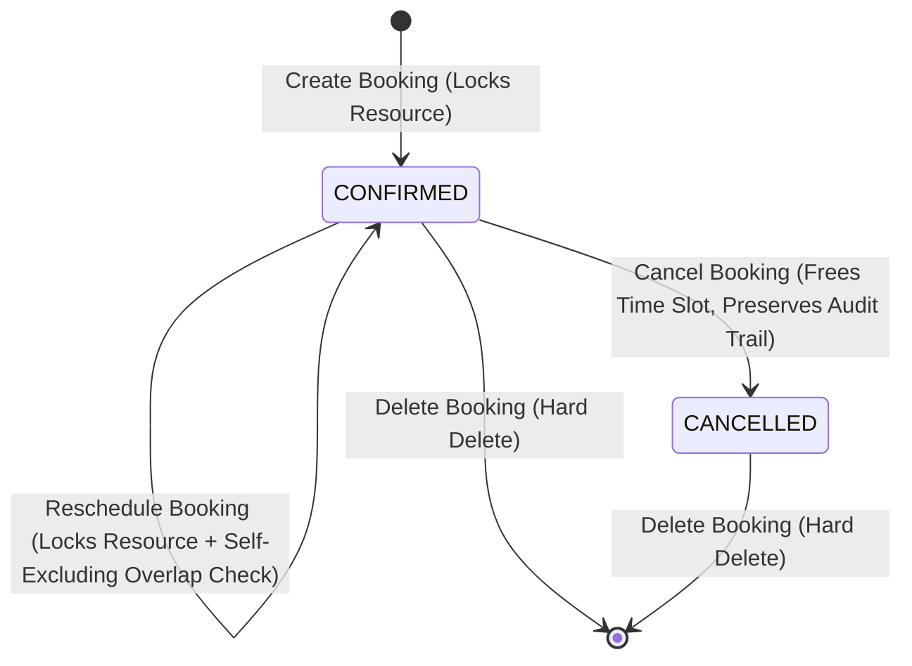

# Phase 3: Core Business Logic & Concurrency Protection Engine

This document details the architectural design, implementation details, and verification results for **Phase 3 (Core Business Logic & Concurrency Protection Engine)** of the room booking system. 

---

## Introduction

In Phase 3, we built the core business engine that handles the booking rules and protects our database against double-bookings when multiple users try to reserve the same room at the exact same moment. 

We established strict time window validations, implemented a mathematical formula to determine whether two time slots overlap, built a row-level locking engine inside PostgreSQL transactions, created clean state transitions for cancellations and rescheduling, and built a global error formatting middleware to translate technical errors into friendly, clear messages.

---

## Section 1: Time Validation & The Half-Open Interval Formula

### 1.1 Time Range Validation
Before we query the database, we perform sanity checks on incoming date inputs to prevent database overhead or corrupted data.
- We check if the dates are valid ISO timestamp strings.
- We verify that `startTime` is strictly before `endTime` (we cannot book a room that ends before it starts).
- If validation fails, the service immediately throws an `INVALID_TIME_RANGE` error.

### 1.2 Half-Open Interval Overlap Formula
We represent bookings as **half-open intervals**:
$$\text{Booking Slot} = [\text{startTime}, \text{endTime})$$
This means that a booking includes the start time but excludes the end time. 

#### The Analogy: Back-to-Back Bookings
Imagine a class in a lecture hall. Class A is scheduled from **10:00 AM to 11:00 AM**, and Class B is scheduled from **11:00 AM to 12:00 PM**.
- At exactly **11:00 AM**, Class A leaves, and Class B enters.
- They do **not** overlap because Class A ends at 11:00 AM (exclusive) and Class B begins at 11:00 AM (inclusive).

To enforce this, we check for active conflicts against existing `CONFIRMED` bookings using the following formula:
$$\text{existing.startTime} < \text{newEnd} \quad \text{AND} \quad \text{existing.endTime} > \text{newStart}$$

If a booking's status is `CANCELLED`, it is excluded from these checks, freeing up the time slot instantly.

---

## Section 2: Concurrency Protection Engine (How Row-Locking Works)

### 2.1 The Race Condition Problem
Imagine two users, Alice and Bob, looking at the availability of the "Boardroom" for 2:00 PM to 3:00 PM at the exact same millisecond.
1. Alice's request checks availability: The room is free.
2. Bob's request checks availability: The room is free.
3. Alice's request inserts a booking.
4. Bob's request inserts a booking.
5. **Result**: A double-booking occurs.

If we only query the bookings table with `SELECT ... FOR UPDATE`, it locks existing booking rows. But if the room has **zero** bookings scheduled during that time slot, the query returns 0 rows. In databases, **you cannot lock a row that does not exist**. Alice and Bob's queries lock nothing, proceed concurrently, and insert conflicting rows.

### 2.2 The Solution: Resource-Level Row Locking
To solve this, we lock the **room itself** (the `Resource` row) rather than individual bookings.
When a user attempts to create or reschedule a booking, the operation is wrapped in a PostgreSQL interactive transaction (`prisma.$transaction`) and runs this SQL query first:

```sql
SELECT "id" FROM "Resource" WHERE "id" = $1 FOR UPDATE;
```

#### The Analogy: The Room Key Hook
Think of the `Resource` row as a physical hook on a wall holding a single **room key**.
* When Alice wants to make a booking for the Boardroom, she goes to the hook, takes the key (`FOR UPDATE` lock), and holds it.
* While Alice holds the key, Bob arrives to book the same room. He sees the hook is empty and is forced to wait in line.
* Alice checks the calendar (overlap logic), writes her booking down, and hangs the key back on the hook (transaction commits).
* Bob can now take the key. He checks the calendar, sees Alice's new booking, and receives a `RESOURCE_UNAVAILABLE` conflict response.
* **Result**: Alice and Bob are serialized (processed one after the other), making double-booking mathematically impossible.

---

## Section 3: Booking Lifecycle (Rescheduling, Cancellation, and Deletion)

We implemented state transitions to manage how bookings are updated or removed:



1. **Rescheduling (`rescheduleBooking`)**:
   Allows a user to move their booking to a different time slot. 
   - It locks the target `Resource` row.
   - It performs overlap checks but **excludes the booking itself** from collision results (so you do not conflict with your own booking when moving it).
2. **Cancellation (`cancelBooking`)**:
   Updates the booking status from `CONFIRMED` to `CANCELLED`. This releases the time slot for future bookings while preserving historical records for audits. Attempting to cancel an already cancelled booking throws `BOOKING_ALREADY_CANCELLED`.
3. **Deletion (`deleteBooking`)**:
   Permanently deletes the record from the database.

---

## Section 4: User-Friendly Error Formatting

By default, GraphQL Yoga masks any unhandled JavaScript error and displays a generic `"Unexpected error."` (Internal Server Error) to protect server secrets. However, this is not helpful to users.

To solve this, we built a global error formatter in [index.ts](file:///d:/Meeting_Room_Booking_System/backend/app/index.ts) using the GraphQL Yoga `maskedErrors.maskError` middleware:

1. **Error Map ([errors.ts](file:///d:/Meeting_Room_Booking_System/backend/app/graphql/errors.ts))**:
   Defines user-friendly, descriptive messages, HTTP status codes, and GraphQL error codes:
   - `RESOURCE_UNAVAILABLE` $\rightarrow$ *"This meeting room is already reserved during the requested time slot. Please choose another time."* (HTTP 409)
   - `BOOKING_NOT_FOUND` $\rightarrow$ *"The requested booking could not be found."* (HTTP 404)
   - `INVALID_TIME_RANGE` $\rightarrow$ *"The start time of the booking must be earlier than the end time, and both dates must be valid."* (HTTP 400)
2. **Error Translation**:
   When an error is thrown, the formatter intercepts it. If it matches a key in our map, it converts it into a structured GraphQL error with extensions. Unmapped errors default to a friendly fallback: *"An unexpected error occurred. Please try again later."*

---

## Section 5: Verification & Tests

We ran checks to guarantee code quality and stability:

### 5.1 TypeScript Compilation Check
Strict mode verification ensures correct type contracts across all services and resolvers:
```bash
bun x tsc --noEmit
# Result: 0 errors
```

### 5.2 Automated Test Execution
We run Bun's native test runner to execute unit, concurrency, and E2E API tests:
```bash
bun test
```

All **11 tests** pass successfully:
```text
tests\booking.test.ts:
✓ 1. Time Range Validation: Reject invalid startTime >= endTime [0.86ms]
✓ 2. Half-Open Interval Overlap: Reject overlapping booking [27.51ms]
✓ 3. Half-Open Interval Boundary: Allow back-to-back bookings [9.47ms]
✓ 4. Cancelled Booking Exclusion: Free up time slot when booking is cancelled [13.60ms]
✓ 5. Rescheduling Logic: Self-exclusion allows moving booking within open or same slot [12.09ms]
✓ 6. Cancellation & Double Cancel Guard [10.55ms]
✓ 7. Hard Deletion [12.57ms]
✓ 8. Check Availability Query [9.50ms]

tests\concurrency.test.ts:
✓ Concurrent double-booking race condition: exactly 1 succeeds, 1 fails [204.63ms]

tests\graphql.test.ts:
✓ 1. Overlapping booking returns user-friendly RESOURCE_UNAVAILABLE message and code [18.50ms]
✓ 2. Cancelling non-existent booking returns user-friendly BOOKING_NOT_FOUND error [3.03ms]

 11 pass
 0 fail
 27 expect() calls
Ran 11 tests across 3 files. [547.00ms]
```
